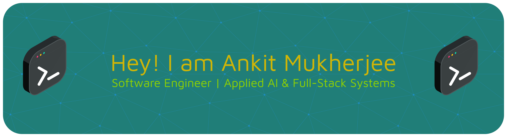

  

## 🔥 About Me

I'm a software engineer focused on building **production-grade AI systems** that solve real-world problems.

- Designed multi-agent **RAG-based AI platforms** with cross-agent memory  
- Built **LLM orchestration systems** integrating GPT-4, Gemini, and Perplexity  
- Developed **AI-powered document processing pipelines** with 90%+ accuracy  
- Experience across **full-stack development + AI/ML + distributed systems**

> **AI × Systems × Product**

---

## 🧠 Tech Stack

**🚀 Languages**

 

**🤖 AI / ML**

 

**⚙️ Backend & infra**

 

**🌐 Frontend**

 

**☁️ Cloud & DevOps**

---

## 🚧 Currently building

### [Cadence](https://github.com/ankitmukherjee101/cadence)

**A voice-first personal assistant that turns how you *talk* about your day into structured data you can query later.**

Cadence turns messy, time-relative speech into **normalized activities, sentiment, and timelines**—so you can ask richer questions than a typical journaling or habit app. It’s a **small monorepo**: Expo mobile client, **FastAPI** agent + voice pipeline, **Supabase (Postgres + pgvector)**, and **Neo4j** for correlation-style queries; LLM and speech keys stay on the server.

**Why it’s interesting:** voice-first UX (e.g. Deepgram via backend), **LangGraph + Groq** with structured outputs (Pydantic), temporal grounding, hybrid relational + vector + graph data. 

---

## 🏗️ Featured Work

### 🧾 AI-Powered Government Forms Assistant
- Built a **multi-tenant RAG system** with 50+ specialized agents  
- Reduced latency by **40%** and improved response accuracy  
- Designed **LLM routing layer** → cut API costs by **30–50%**  
- Developed **PDF understanding pipeline** with 90%+ field detection  

---

### 📈 Financial Intelligence Pipeline (QuantumStreet AI)
- Built large-scale **news ingestion + NLP sentiment pipeline**  
- Improved signal precision by **30%**  
- Reduced processing latency by **40%**  

---

## 📈 What Sets Me Apart

- I build **end-to-end AI products**, not just models  
- Strong focus on **latency, cost, and scalability**  
- Combine **systems thinking + AI intuition**  
- Experience with **real production systems**  

---

## 📫 Let’s Connect

- 📧 ankitmukherjee01@gmail.com  
- 💼 [LinkedIn](https://linkedin.com/in/ankitmukherjee01)  

---

